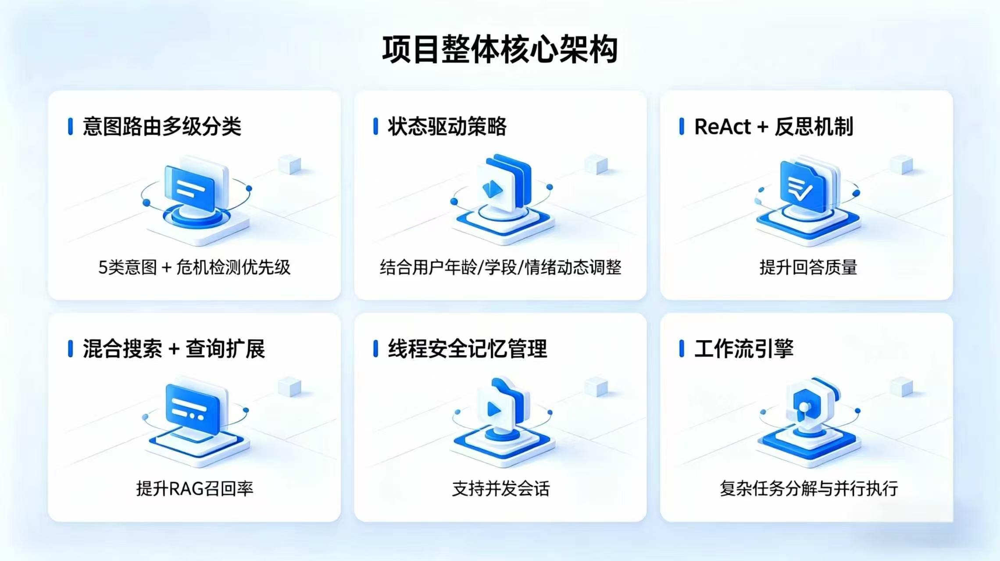
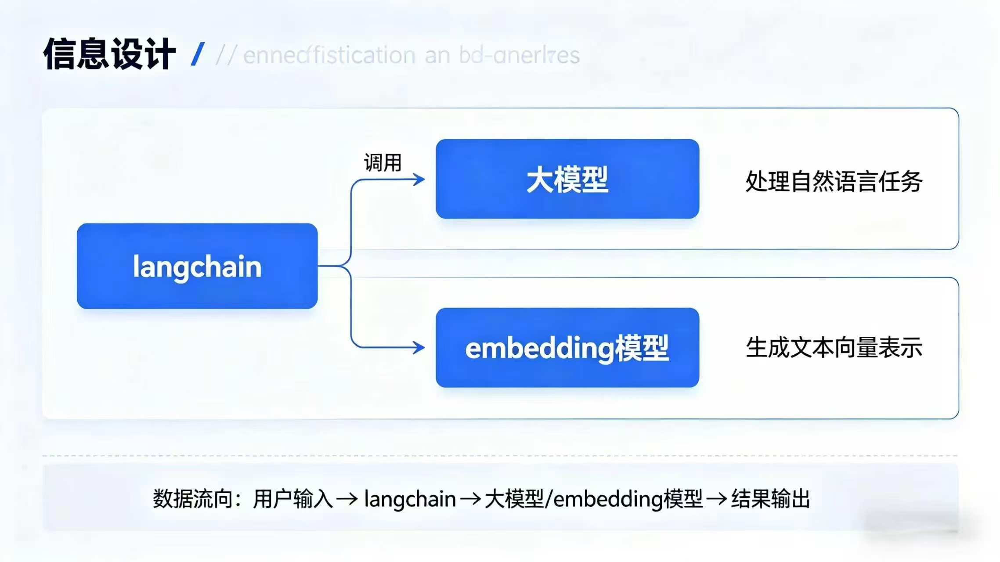
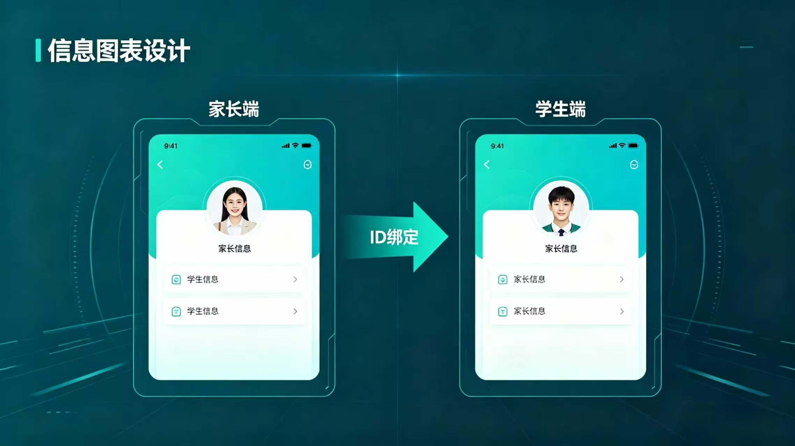
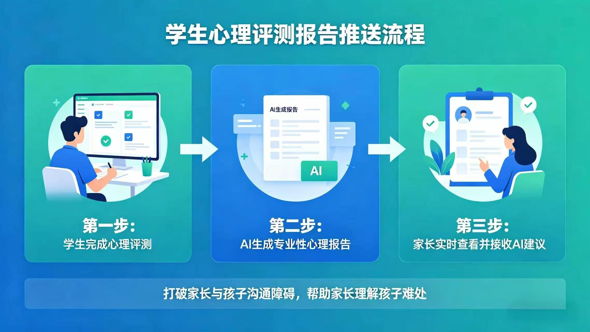

# WarmStudy（暖学帮）

<div align="center">


</div>

WarmStudy（暖学帮）是一套面向青少年心理关怀场景的教育智能体原型系统，聚焦学校与家庭协同支持中的“助育”问题。  
它不是普通的聊天机器人，也不是单纯的信息展示应用，而是一套把学生表达、家长支持、心理知识、风险提醒、后台管理与知识库检索串成闭环的场景化智能体系统。

> 让智能体不只是“回答问题”，而是真正理解角色、年龄、状态与场景，再给出更合适的心理支持与沟通建议。

说明：  
本项目的前端应用形态建议统一表述为“基于微信小程序技术实现的 App 应用前端”。  
`WarnStudty/` 是该 App 的前端工程载体，不建议简单理解为普通小程序演示项目。

---

## 项目亮点

### 1. 面向真实教育心理场景

WarmStudy 围绕青少年心理关怀、家庭沟通和日常支持展开设计，重点解决以下问题：

- 学生有情绪压力，但缺少低门槛、可持续的表达入口
- 家长难以及时理解孩子的长期状态变化
- 学校心理支持资源有限，难以覆盖高频、轻量、持续性的陪伴需求
- 管理端缺少统一入口来查看模型、知识库与系统运行状态

### 2. 多角色协同，而不是单点工具

- 学生端：情绪陪伴、心理测评、每日打卡、心理知识支持
- 家长端：状态查看、报告解读、预警提醒、沟通建议
- 管理员后台：账号、登录、模型、RAG、活动流、知识库统一管理

### 3. 个性化智能体，而不是固定 Prompt

系统会结合：

- 年龄 / 年级 / 学段
- 近期打卡结果
- 心理测评状态
- 风险变化趋势
- 历史会话上下文

动态刷新智能体策略，使输出更贴近真实用户状态与当前需求。

### 4. 可观测、可配置、可部署

管理员后台可以直接查看和操作：

- 用户与登录账号数据
- 模型使用情况
- `chat / RAG / embedding` 模型配置
- RAG 文件上传、更新、删除、重置、检索、问答
- 近期活动流与系统概览

---

## 核心架构

下图展示了当前项目整体核心架构，重点体现了意图路由、状态驱动策略、ReAct 机制、混合搜索、线程安全记忆管理与工作流引擎的组合方式。



这一层决定了 WarmStudy 不只是“有个模型”，而是具备：

- 多级意图分类与危机检测优先级
- 状态驱动式响应策略
- ReAct + 反思机制提升回答质量
- 混合搜索与查询扩展提升 RAG 召回
- 线程安全的会话记忆管理
- 面向复杂任务的工作流引擎

---

## 技术路线

WarmStudy 当前采用的核心技术路线为：

- 大模型：Qwen / DashScope
- 检索增强：RAG
- 向量库：ChromaDB
- 后端框架：Python / Flask
- 前端形态：基于微信小程序技术实现的 App 前端工程
- 管理端：统一网页控制台

下图体现了项目在信息设计上如何把 `langchain`、大模型和 `embedding` 模型组织成同一条处理链路。



---

## 智能体个性化

### 学生端智能体

学生端智能体强调“先接住情绪，再给出适龄支持”，并根据学段做表达风格调整：

- 小学阶段：短句、具体、少抽象词
- 初中阶段：温和、尊重、减少说教感
- 高中阶段：强调自主感、节奏感和成熟表达

智能体会根据当前状态切换重点，例如：

- 更偏安抚与陪伴
- 更偏一步式建议
- 更偏鼓励表达
- 更偏缓解学习压力刺激

### 家长端智能体

家长端采用独立人格与策略，不复用学生端对话逻辑，重点强调：

- 结构化表达
- 可观察的状态线索
- 可执行的下一步沟通动作
- 避免责备式、贴标签式、制造焦虑式建议

---

## 学生端与家长端联动

WarmStudy 的一个重要特点，是把学生端和家长端做成了真正的联动关系，而不是两个彼此孤立的页面。

下图展示了家长端与学生端的 ID 绑定关系设计：



这意味着系统不仅能做单端陪伴，还能逐步形成：

- 学生表达
- 家长理解
- 后台观察
- 风险提醒

的连续闭环。

---

## 报告闭环与价值链路

WarmStudy 并不把心理测评停留在“测完就结束”，而是进一步组织成报告与建议的完整推送流程。



完整闭环包括：

1. 学生完成心理测评
2. 系统生成结构化、可理解的 AI 心理报告
3. 家长实时查看并接收 AI 建议

这也是本项目区别于普通问答系统的关键之一：  
它强调的不只是生成，而是“可理解、可传递、可后续行动”的支持链路。

---

## 当前版本核心能力

### 学生端

- 登录
- 心理测评
- 情绪打卡
- AI 对话
- 心理知识浏览

### 家长端

- 登录
- 绑定孩子
- 查看状态与报告
- 查看预警
- 获取 AI 沟通建议

### 管理员后台

- App 后台总览
- 用户与登录记录
- 模型使用统计
- 模型配置管理
- RAG 知识库上传、更新、删除、重置
- RAG 检索与问答
- 近期活动流与系统概览

---

## 系统架构与部署

### 对外统一入口：`8000`

- 统一网页入口
- API Gateway
- 管理员后台控制台
- 聚合 App 后台、RAG、模型使用与账号数据

### 内部服务：`5177`

- Agent / RAG API 服务
- 负责检索、问答、知识库与模型配置等能力
- 当前版本不再独立对外提供单独 Web UI

### 本地启动

```powershell
cd agent
.\start_all.ps1
```

启动后访问：

- 管理员后台：`http://localhost:8000/`

### Docker 启动

```powershell
docker compose up --build
```

默认对外暴露端口：

- `8000:8000`

### 关键环境变量

```env
CHAT_MODEL=qwen
DASHSCOPE_API_KEY=your_dashscope_api_key
DASHSCOPE_MODEL=qwen-plus
RAG_DASHSCOPE_MODEL=qwen-plus
DASHSCOPE_EMBEDDING_MODEL=text-embedding-v3
DASHSCOPE_EMBEDDING_FALLBACK_MODEL=text-embedding-v2
AGENT_API_KEY=your_agent_api_key
RAG_AGENT_URL=http://localhost:5177
FLASK_ENV=production
LOG_LEVEL=INFO
```

---

## 推荐阅读

- [项目总说明](docs/COMPETITION_PROJECT_DESCRIPTION.md)
- [产品优势与智能体亮点](docs/AGENT_AND_PRODUCT_ADVANTAGES.md)
- [更新说明](docs/AGENT_REFINEMENT_UPDATE_2026-04-22.md)
- [服务器更新部署步骤](docs/SERVER_UPDATE_DEPLOYMENT.md)
- [文档索引](docs/README.md)

---

## 仓库结构

```text
WarmStudy-main/
├─ WarnStudty/          # 基于微信小程序技术实现的 App 前端工程
├─ agent/               # API Gateway、Agent、RAG、管理员后台
├─ docs/                # 项目说明与部署文档
├─ submission/          # 比赛提交材料
├─ docker-compose.yml   # 根目录 Docker 编排
└─ 2026年广东省大学生计算机设计大赛-本科赛道赛题说明.pdf
```

---

## 参赛团队信息

### 队伍名称

| 项目 | 内容 |
| --- | --- |
| 队伍名称 | 灵感加载中 |

### 队员与导师

| 角色 | 姓名 | 分工 |
| --- | --- | --- |
| 队长 | 卢涛 | 项目统筹、方案设计、答辩组织 |
| 队员 | 涂凯莹 | 前端实现与交互联调 |
| 队员 | 吴楚阳 | 后端接口与数据流转 |
| 队员 | 黎悦淇 | 智能体策略与 RAG 能力实现 |
| 队员 | 陈希曦 | 文档整理、材料整合与测试验证 |
| 指导教师 | 翟诗阳 | 项目指导与技术把关 |

---

## 项目说明

当前仓库以 App 前端工程、Agent / RAG 服务与统一管理员后台为核心，适合用于比赛展示、原型验证与后续功能扩展。  
如果你希望继续增强 GitHub 首页展示效果，下一步还可以继续补：

- 管理员后台截图
- 学生端 / 家长端界面截图
- Release 下载入口
- Demo 视频入口
